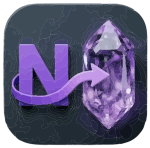

# OneNote to Obsidian Exporter



A robust, automated tool to export Microsoft OneNote notebooks into Obsidian-compatible Markdown folders. This tool preserves your notebook's hierarchy, downloads all attachments (PDFs, images, videos), and correctly resolves internal links.

Available as both a **CLI tool** and a **native desktop app** (Electron GUI) for Mac, Windows, and Linux.

> [!IMPORTANT]
> **New to the project?** Follow the [Installation Guide](INSTALLATION.md) to set up your environment on Mac, Windows, or Linux.

## Features

- **Full Hierarchy Preservation**: Exports Notebooks → Section Groups → Sections → Pages.
- **Rich Content Extraction**:
  - Converts OneNote HTML to clean Markdown.
  - Downloads **PDFs, Word docs, and other attachments** locally.
  - Downloads **Images and Videos** and embeds them with Obsidian syntax.
- **Smart Link Resolution**:
  - Converts internal OneNote links (`onenote:`) to Obsidian Wikilinks (`[[path/to/note]]`).
  - Handles deep links to specific sections or nested pages.
  - specific "Fuzzy ID Matching" to handle OneNote's variable ID formats.
- **Robust File Naming**:
  - Automatically cleans filenames (e.g., removes "Page 1 of 2" suffixes).
  - Handles duplicate page names by appending counters (`Note_1.md`).
- **Security Handling**:
  - Detects password-protected sections.
  - Interactive "Pause & Unlock" mode (requires `--notheadless`).
  - Automated skip mode: Sections are automatically skipped when running in **headless mode** (default) to prevent automated runs from getting stuck.
  - Manual skip mode (`--nopassasked`) for hands-free backups in visible mode.
- **Automation Ready**: Check/Login/Export commands with CLI flags for fully automated workflows.

## Electron GUI

A desktop application with a graphical interface is available for a more user-friendly experience.

### Run in development mode
```bash
npm run electron:dev
```

### Build a distributable package
```bash
# macOS (DMG)
npm run electron:build:mac

# Windows (installer)
npm run electron:build:win

# Linux (AppImage)
npm run electron:build:linux
```

Built packages are output to the `dist/` folder.

---

## Installation (CLI)

```bash
npm install
```

## Usage

### 1. Authentication
First, log in to your Microsoft Account. 

**Manual Mode**: Launches a browser window for you to sign in.
```bash
node src/index.js login
```

**Non-Interactive Mode**: Provide credentials directly (useful for automated environments).
```bash
node src/index.js login --login "your-email@example.com" --password "your-password"
```

> [!TIP]
> **MFA Support**: The tool includes an advanced "Resilient MFA" handler. While some accounts may still require a one-time manual `login` in visible mode, the automated `login --login email --password pass` command now supports many MFA flows (like switching to password entry or "Stay signed in" prompts) automatically.


### 2. Interactive Export
List available notebooks and select one to export.

```bash
node src/index.js export
```

### 3. Automated Export
Bypass the selection prompt by specifying the notebook name directly.

```bash
# Export specific notebook
node src/index.js export --notebook "My Notebook Name"

# Export completely hands-free (skip password protected sections)
node src/index.js export --notebook "My Notebook Name" --nopassasked

# Export a specific notebook using its URL
node src/index.js export --notebook-link 'https://...link.../to/.notebook'

# Export a specific notebook using its URL, skip password protected sections and dump HTML files for debugging
node src/index.js export --notebook-link 'https://...link...' --nopassasked --dodump
```

### 4. Debugging
If you encounter issues, you can run in visible mode or dump DOM snapshots.

```bash
# Run with a visible browser window (useful for debugging or manual login)
node src/index.js export --notheadless

# Visible mode for login automation
node src/index.js login --login "email" --password "pass" --notheadless

# Dump HTML files for debugging if automation fails
node src/index.js login --login "email" --password "pass" --dodump
node src/index.js export --dodump
```

> [!NOTE]
> **Headless Mode vs. Passwords**: By default, the tool runs in "headless" mode (invisible). Since you cannot interact with an invisible browser to unlock sections, the tool will **automatically skip** password-protected sections and act as if `--nopassasked` was set. To unlock sections manually, you **must** use the `--notheadless` flag.

> [!WARNING]
> The `--dodump` option saves the HTML content of every page and frame encountered to disk. For large notebooks, this can consume a significant amount of disk space and create thousands of files. Use it only for troubleshooting specific issues.

## Maintenance & Cleanup

The project includes built-in scripts to clean up generated files, logs, and caches.

### Safe Clean
Removes temporary files, logs, and caches while **preserving** your exported notebooks (`output/`) and authentication session (`auth.json`).
```bash
npm run clean
```

### Full Reset
Performs a complete reset by removing everything, including your exported notebooks and saved login information.
```bash
npm run cleanfull
```

> [!CAUTION]
> `npm run cleanfull` will delete your `auth.json` and `output/` folders. You will need to log in again and re-run your exports.

## Cumulative Example
You can combine all options for a fully automated, visible, and documented run:

```bash
node src/index.js export --notebook "My Notebook Name" --nopassasked --notheadless --dodump
```

## Output Structure

The tool creates an `output` directory:

```
output/
  └── Notebook Name/
      ├── Section Group/
      │   ├── Section A/
      │   │   ├── Page 1.md
      │   │   ├── Page 1_1.md (Duplicate handling)
      │   │   └── assets/
      │   │       ├── Page 1.pdf
      │   │       └── Page 1.png
      │   └── Subsection/
      │       └── Page 2.md
      └── Section B/
          └── ...
```
