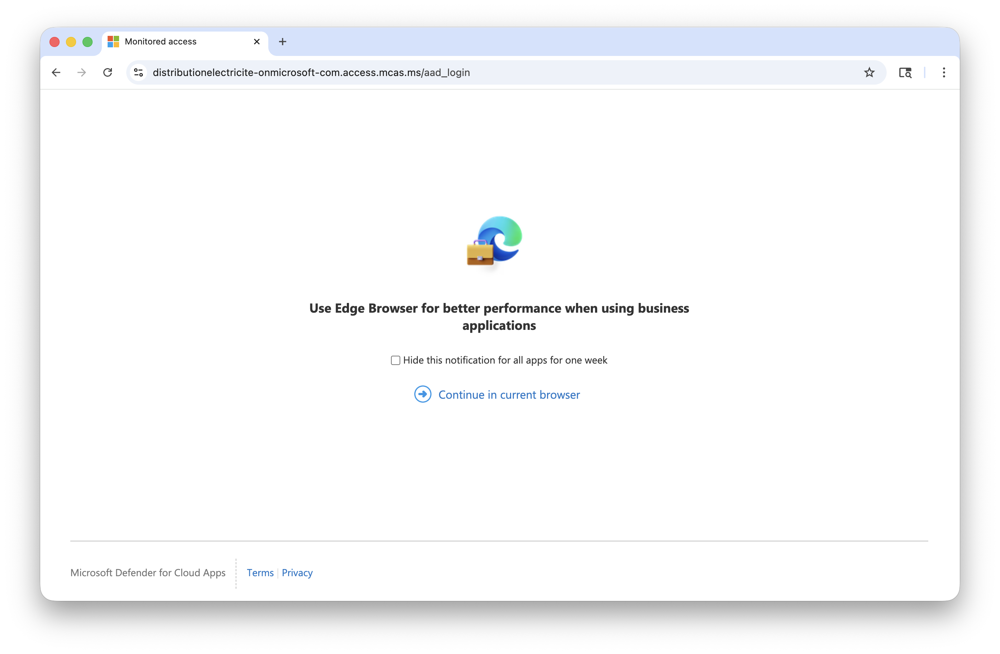

Breakdown of issue encountered with bypassing mcas page recommending to use edge:

The issue is that `page.$('a:has-text(...)')` isn't reliable — it queries immediately and the element may not be interactive yet, or the selector engine doesn't parse it the same way as `page.locator()`. Let me check the dump file first to see what the actual HTML looks like:

Ran command: `grep -i "continue\|checkbox\|hide\|button\|href" debug_notebook_link.html | head -60`

The HTML reveals the issue: **"Continue in current browser" is an `<input type="submit">`, not an `<a>` tag**. That's why the `a:has-text(...)` selector found nothing. The correct element is:

```html
<input id="hiddenformSubmitBtn" type="submit" class="proxyweb-btn_submit proxyweb-continue-to-app" value="Continue in current browser">
```

Edited navigator.js

Fixed. The root cause was a wrong assumption about the element type. From the dump:

```html
<!-- What we assumed (wrong): -->
<a>Continue in current browser</a>

<!-- What it actually is: -->
<input id="hiddenformSubmitBtn" type="submit" class="proxyweb-continue-to-app" value="Continue in current browser">
```

### Changes in `navigator.js`

| | Before | After |
|---|---|---|
| **Checkbox selector** | `input[type="checkbox"]` (first match) | `#skip-disclaimer-checkbox` (stable id) |
| **Continue selector** | `a:has-text("Continue...")` (wrong element type) | `#hiddenformSubmitBtn` (stable id, correct `input[type=submit]`) |
| **Timing** | Immediate query | `waitForSelector('#skip-disclaimer-checkbox', timeout: 10s)` before querying |

